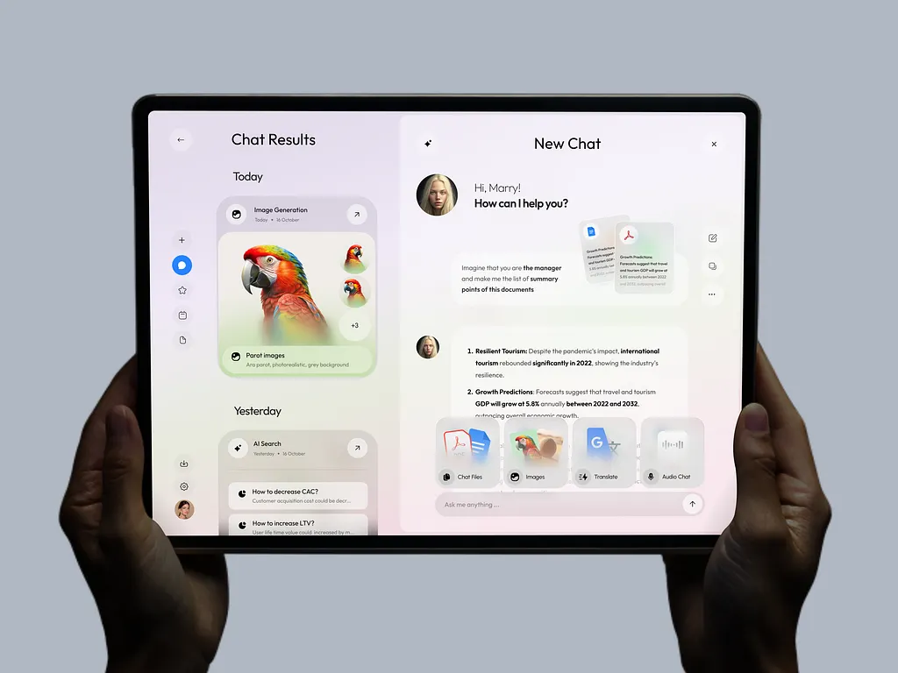

# PartyBear's Miscellaneous V2.0

**PartyBear's Miscellaneous** is a web platform that blends the passion for **football** with the digital culture of modern **brainrots**.  
Here you’ll find real-time match results, data-based predictions, and the most viral football-related content.

## Project Description

This project aims to combine **sports analytics, prediction modeling, and entertainment** in one place.  
Built with **HTML, CSS, and JavaScript**, the website is fully responsive and adaptable to any device.

The main sections include:
 
- **Predictions:** smart and interactive football match outcome predictions.  
- **Brainrots:** the funniest and trendiest memes.  
- **Landing Page:** a quick introduction to what the project offers.
- **Matches:** A list of the matches saved on LocalStorage (read).
- **Manage Matches:** Modify, delete, create your current matches stored on LocalStorage.

## What did I base this project on?

This project was based on the following template:

- [Dribble - Genie Personal AI Assistant](https://dribbble.com/shots/25109551-Genie-Chatbot-Personal-AI-Assistant)

This is because I used the same structure on the landing page (using left and right containters).



---

## What's New (V2.0)

This update introduces a full set of improvements that make the platform smoother, more modern, more interactive, and visually impressive.

### New Features & Improvements

#### New Mobile Menu (Redesigned)
- Slide-in navigation drawer  
- Background dimming overlay  
- Improved accessibility with ARIA attributes

#### Fully Responsive Footer 
- Better allignment for desktops  
- Scales icons and text cleanly

#### Parallax Hero Experience
- High-quality multi-layer parallax (background + text + Mbappé)  
- Scroll-based animations  
- Responsive layering to avoid overlap  
- Optimized transform animations for performance

#### Matches CRUD System
- Store matches with **localStorage**  
- Add/edit/delete matches with a dedicated UI  
- Responsive match grid  
- Persistent data sync with the browser
- Quick advice: if you want to reset your localstorage use in the console:

```JavaScript
   localStorage.clear()
   ```


## Getting Started

Follow these steps to get a local copy of the project running for development or testing.

---

### Prerequisites

You’ll need:
- A modern web browser (Chrome, Firefox, Edge, etc.)
- [Visual Studio Code](https://code.visualstudio.com/) or another compatible editor
- *(Optional)* [Live Server](https://marketplace.visualstudio.com/items?itemName=ritwickdey.LiveServer) for local preview

---

### Installation

1. Clone the repository:
   ```bash
   git clone https://github.com/partybearcode/partybear-miscellaneous.git
   ```

2. Navigate to the project folder:
   ```bash
   cd partybear-miscellaneous
   ```

3. Open it in your code editor:
   ```bash
   code .
   ```

4. Run the project locally by opening `index.html` or using **Live Server**.

---
.

## Built With

- **HTML5** – website structure  
- **CSS3 / Flexbox / Media Queries** – responsive design  
- **JavaScript** – interactivity and prediction engine  
- **Font Awesome** – modern icons  

---

## Code Style Guidelines

To maintain consistency:

- **JavaScript Classes:** `PascalCase`  
- **Variables & Functions:** `camelCase`  
- **Constants:** `SNAKE_CASE`  
- **CSS IDs & Classes:** `hyphen-case`  
- **HTML Tags & Attributes:** lowercase  
- **File & Folder Names:** lowercase with hyphens  
- **Note:** Some names may be in another language, this is because it is a proper noun.

---


## Authors

- **PartyBear** — Main developer and designer  
  GitHub: [@partybearcode](https://github.com/partybearcode)

---

## Acknowledgments

- Thanks to the football online community and content creators.  
- To [**Font Awesome**](https://fontawesome.com/) for providing the icon library. 
- To everyone supporting and contributing ideas to PartyBear’s Miscellaneous.
- Thanks to [**W3Schools**](https://www.w3schools.com/) for giving out the free tutorials out there so people can learn HTML, CSS & JS.
- Thanks to the [**StackOverFlow**](https://stackoverflow.com/questions) community for giving out of code examples and advices! This helped a lot on this project!
- AI has been used for learning purposes (Ex. I didn't understand something on StackOverFlow so the AI gives me more detailed example).
- Also, AI has been used too for repetitive tasks (Ex. filling out content on the page so I don't waste time.).
- Thanks to [**UIverse**](https://uiverse.io/) community for giving out CSS code templates! This also helped a lot on this project!
- Thanks to **BeJob & IBM Python course** for giving out a complete guide for HTML, CSS & JS.
- I also would like to thank TikTok user [**Rubem Frontend**](https://www.tiktok.com/@rubem.frontend) for teaching really cool CSS tricks in less than a minute. This really helped me a lot in the V2.0 version.
---

> “Where football analysis meets the chaos of the internet.”  
> — *PartyBear’s Miscellaneous*